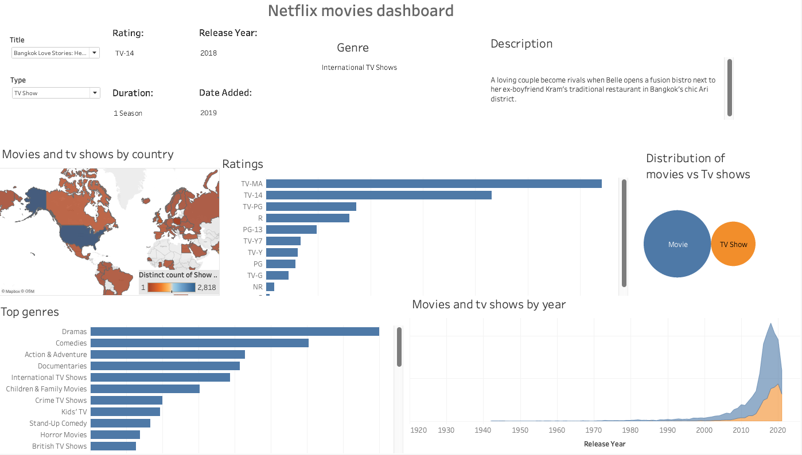

# Netflix Movies Dashboard – README

This dashboard helps you explore Netflix data, like where shows are available, what genres are most popular, and how content has grown over the years. It’s simple to use and full of useful insights.

---

## 📸 Dashboard Overview

Here’s what the dashboard looks like and what you’ll find when you open it:

---

## How to Use the Dashboard

### Filters (Top Left Corner)
- **Title**: Select a movie or show to see its details like genre, release year, and description.
- **Type**: Choose to view only "TV Shows" or "Movies".

### Title Details
Once a title is selected, you’ll see:
- Rating (e.g., TV-14, R)
- Release year
- Duration (e.g., 1 Season or 100 min)
- Date added to Netflix
- Genre
- Description

---

## Visualizations in the Dashboard

### 1. **Map – Movies and TV Shows by Country**
Shows how many shows/movies are available in each country. Darker colors mean more titles.

### 2. **Ratings Chart**
Bar chart showing how many titles fall under each content rating (TV-MA, PG, etc.).

### 3. **Movies vs TV Shows Distribution**
Bubble chart comparing how many movies vs TV shows are in the dataset.

### 4. **Top Genres**
Bar chart showing the most common genres (like Drama, Comedy, Action, etc.).

### 5. **Movies and TV Shows by Year**
Area chart showing the number of titles released each year.

---

## Key Insights

- Netflix has **more movies than TV shows**.
- Most content is rated **TV-MA** or **TV-14**, focused on teens and adults.
- Top genres include **Drama**, **Comedy**, and **Action & Adventure**.
- **United States**, **India**, and **Canada** have the largest libraries.
- Netflix content grew rapidly after **2010**, especially between 2015–2020.

---

## Tips for Exploring

- Use the dropdown filters to look at specific types or titles.
- Hover over the map to see how many titles are in each country.
- Look at the trends over time to see when Netflix grew the most.
- Explore ratings and genres to learn about content focus.

---

## Requirements to View Interactive Version

If you're using the interactive dashboard:
- You’ll need **Tableau Public** or **Tableau Reader** (both are free).
- Or access the dashboard via a shared Tableau link (if provided).

